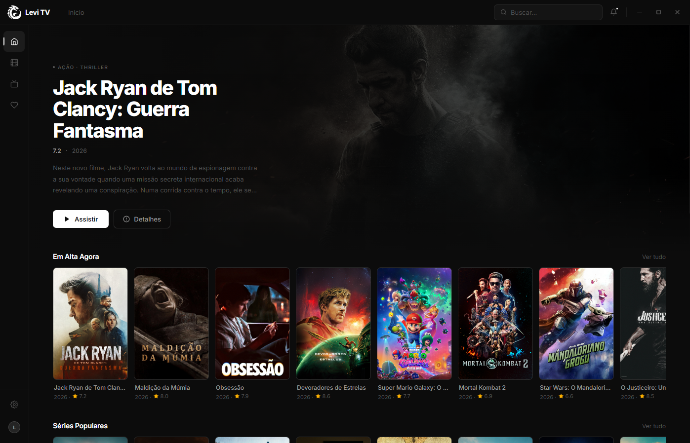

# Levi TV

<p align="center">
  
</p>

<p align="center">
  <strong>O launcher de filmes e séries para o século XXI.</strong>
</p>

<p align="center">
  Open-source · Windows, macOS e Linux · Interface limpa e focada no conteúdo
</p>

<p align="center">
  <a href="#download">Download</a> ·
  <a href="#recursos">Recursos</a> ·
  <a href="#levi-cloud">Levi Cloud</a> ·
  <a href="#contribuir">Contribuir</a>
</p>

---

## O que é o Levi TV?

**Levi TV** é um launcher de mídia **open-source** para quem quer **organizar, descobrir e assistir** filmes e séries sem abrir dez aplicativos diferentes.

Tudo em uma interface **preta e branca**, direta e profissional — catálogo, biblioteca, player e progresso no mesmo lugar.

<p align="center">
  
</p>

---

## Recursos

### Catálogo e biblioteca
- **Início** com destaques, “Em alta” e carrosséis de séries populares  
- **Catálogo** unificado de filmes e séries  
- **Minha biblioteca** com listas e filtros rápidos  
- Página de **detalhes** com sinopse, nota, duração e ações (assistir, adicionar à lista)

### Assistir e acompanhar
- **Player integrado** com retomada de onde parou  
- **Histórico de exibição** — saiba o que já viu e por quanto tempo  
- **Avaliações pessoais** para montar sua crítica particular  

### Social e nuvem
- Veja **o que seus amigos estão assistindo**  
- **Levi Cloud** — sincronize listas e progresso entre PC, TV e celular  

### Plataforma
- **Downloader integrado** para organizar suas fontes em um só lugar  
- **Windows, macOS e Linux**  
- **Atualizações constantes** com novos recursos e correções  

---

## Download

> **Beta pública em breve.**  
> O Levi TV ainda não está disponível para download geral. Acompanhe este repositório e as [Releases](https://levilauncher/LeviTV/releases) para saber quando a beta abrir.

| Plataforma | Status |
|------------|--------|
| Windows 10+ (64-bit) | Em breve |
| macOS 12+ | Em breve |
| Linux (AppImage / .deb) | Em breve |

Quando lançarmos, os instaladores oficiais estarão em **Releases**.

---

## Levi Cloud

A versão **gratuita** do Levi TV traz tudo que você precisa para começar. O **Levi Cloud** é o plano premium (**R$ 9,99/mês**) para quem quer ir além:

| Recurso | Descrição |
|---------|-----------|
| **Acesso antecipado** | Teste novidades antes de todo mundo |
| **Tudo na nuvem** | Listas e progresso em qualquer dispositivo |
| **Suporte prioritário** | Atendimento dedicado |
| **Perfil exclusivo** | Personalize sua presença no Levi TV |

---

## Por que open-source?

Acreditamos que ferramentas de mídia devem estar **nas mãos dos usuários**.

- Código público no GitHub  
- Comunidade pode **auditar**, **contribuir** e **criar forks**  
- Transparência no que o app faz (e no que não faz)

---

## Perguntas frequentes

**O Levi TV é gratuito?**  
Sim. A base é gratuita; o Levi Cloud é opcional.

**O Levi TV distribui filmes e séries?**  
Não. É um **launcher e organizador**. Você conecta suas próprias fontes e biblioteca.

**É seguro?**  
Recomendamos baixar apenas dos **releases oficiais** deste repositório. Por ser open-source, o código pode ser revisado por qualquer pessoa.

**Como contribuo?**  
Issues, pull requests e feedback são bem-vindos. Veja [Contribuir](#contribuir).

---

## Contribuir

Quer ajudar a construir o Levi TV?

1. **Star** no repositório  
2. Abra uma **Issue** com bugs ou ideias  
3. Envie um **Pull Request** com melhorias  
4. Compartilhe o projeto com quem curte filmes e séries  

```bash
git clone https://github.com/levilauncher/LeviTV.git
cd levi
```

---

## Roadmap

- [x] Identidade visual e interface do app  
- [x] Sites oficiais (landing + beta em breve)  
- [ ] **Beta pública** (Windows, macOS, Linux)  
- [ ] Primeiro release estável  
- [ ] Levi Cloud  

---

## Licença

Distribuído como projeto **open-source**. A licença definitiva será publicada antes do primeiro release público do launcher.

---

## Aviso legal

O **Levi TV** não hospeda, não vende e não distribui conteúdo audiovisual. O usuário é responsável por suas fontes e pelo uso em conformidade com as leis aplicáveis.

  <strong>Levi TV</strong> — simples, rápido e sob seu controle.
</p>
